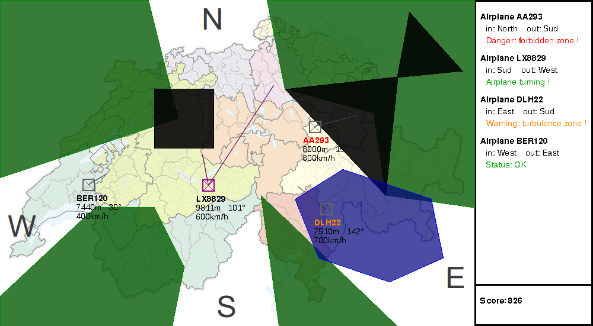

# ATCsim

ATCsim (Air Traffic Control simulation) is the 2013 project of an introduction
course on object-oriented programming in C++ at EPFL (CS-118). It simulates an
(obviously simplified) Air Traffic Control workstation.



## Goal

The goal of this project was mainly C++ training. We focused on C++11
improvements and new features, as it makes this language more powerful, and
easier to use for application development. We also focused on the toolkit, using
of course gcc, netbeans, but also git and clang. We tried as much as possible to
follow design patterns and best practices.

## Installation

You need a recent version of GCC (>= 4.7) to compile our project due to the use
of C++11 new features. The [SDL](https://www.libsdl.org/) is used for graphics.

```sh
git clone https://github.com/mdeff/atcsim.git
cd atcsim
make
./ATCsim system_description.xml
```

## Configuration

Basic constants (like entity speed control, distance before collision etc.) can
be changed in the Constants.h header file.

## Authors

* Michaël Defferrard, michael.defferrard@epfl.ch
* Enguerrand Granoux, enguerrand.granoux@epfl.ch
